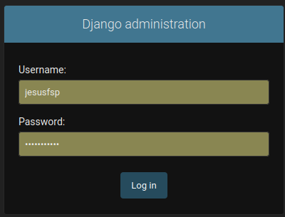
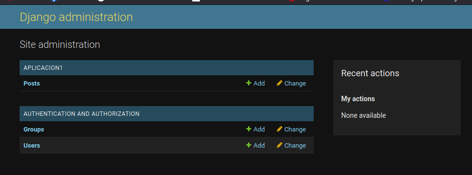
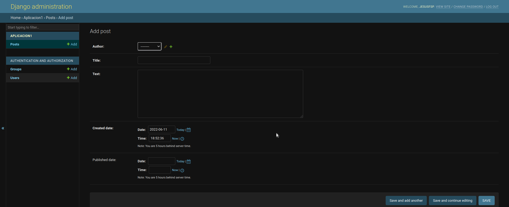
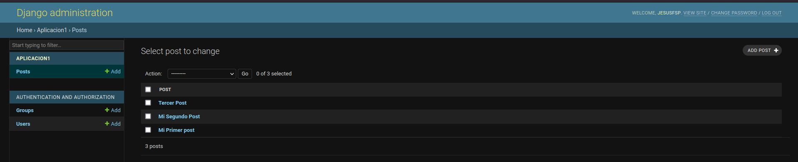
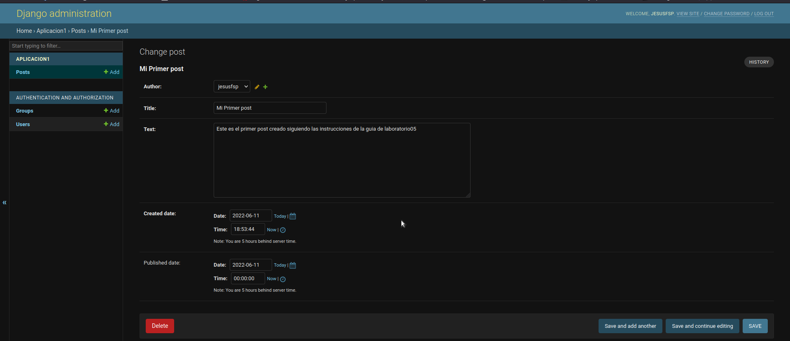

<div align="center">
<table>
    <theader>
        <tr>
            <td></td>
            <th>
                <span style="font-weight:bold;">UNIVERSIDAD NACIONAL DE SAN AGUSTIN</span><br />
                <span style="font-weight:bold;">FACULTAD DE INGENIERÍA DE PRODUCCIÓN Y SERVICIOS</span><br />
                <span style="font-weight:bold;">DEPARTAMENTO ACADÉMICO DE INGENIERÍA DE SISTEMAS E INFORMÁTICA</span><br />
                <span style="font-weight:bold;">ESCUELA PROFESIONAL DE INGENIERÍA DE SISTEMAS</span>
            </th>
            <td></td>
        </tr>
    </theader>
    <tbody>
        <tr><td colspan="3"><span style="font-weight:bold;">Formato</span>: INFORME DE LABORATORIO</td></tr>
        <tr><td><span style="font-weight:bold;">Aprobación</span>:  2022/03/01</td><td><span style="font-weight:bold;">Código</span>: GUIA-PRLD-001</td><td><span style="font-weight:bold;">Página</span>: 1</td></tr>
    </tbody>
</table>
</div>

<div align="center">
<span style="font-weight:bold;">INFORME DE LABORATORIO</span><br />
</div>


<table>
<theader>
<tr><th colspan="6">INFORMACIÓN BÁSICA</th></tr>
</theader>
<tbody>
<tr><td>ASIGNATURA:</td><td colspan="5">Programación Web 2</td></tr>
<tr><td>TÍTULO DE LA PRÁCTICA:</td><td colspan="5">Pilas y Colas</td></tr>
<tr>
<td>NÚMERO DE PRÁCTICA:</td><td>03</td><td>AÑO LECTIVO:</td><td>2022 A</td><td>NRO. SEMESTRE:</td><td>III</td>
</tr>
<tr>
<td>FECHA INICIO:</td><td>12-Jun-2022</td><td>HORA DE PRESENTACION:</td><td>23:55</td>
</tr>
<tr><td colspan="6">INTEGRANTES:
    <ul>
        <li>Silva Pino Jesus Francisco - jsilva@unsa.edu.pe</li>        
    </ul>
    <td>NOTA:</td><td></td>
<tr>
<tr><td colspan="6">DOCENTES:
<ul>
<li>Richart Smith Escobedo Quispe - rescobedoq@unsa.edu.pe</li>
</ul>
</td>
</<tr>
</tdbody>
</table>

# Django

[![License][license]][license-file]
[![Downloads][downloads]][releases]
[![Last Commit][last-commit]][releases]

[![Debian][Debian]][debian-site]
[![Git][Git]][git-site]
[![GitHub][GitHub]][github-site]
[![Vim][Vim]][vim-site]
[![Java][Java]][java-site]

#

# SOLUCIÓN Y RESULTADOS

## EJERCICIOS PROPUESTOS
-   Crea un blog sencillo en un entorno virtual utilizando la guía: https://tutorial.djangogirls.org/es/django_start_project/
-   Especificar paso a paso la creación del blog en su informe.
-   Crear un video tutorial donde realice las operaciones CRUD (URL public reproducible online)
-   Adjuntar URL del video en el informe.

### Creando el Blog Personal
-   Crea el directorio para trabajar Django dentro de un entorno virtual:
    ```sh
    mkdir django_env
    ```
    ```sh
    tree .
    ```
    ```sh
    .
    ├── django_env
    └── README.md
    1 directory, 1 file
    ```

-   Crear el entorno virtual dentro del directorio creado:
    ```sh
    cd django_env
    virtualenv -p python3 env
    ```
    ```sh
    created virtual environment CPython3.9.2.final.0-64 in 3932ms
    creator CPython3Posix(dest=/.../env, clear=False, no_vcs_ignore=False, global=False)
    seeder FromAppData(download=False, pip=bundle, setuptools=bundle, wheel=bundle, via=copy, app_data_dir=/home/.../.local/share/virtualenv)
    added seed packages: pip==22.0.4, setuptools==62.1.0, wheel==0.37.1
    activators BashActivator,CShellActivator,FishActivator,NushellActivator,PowerShellActivator,PythonActivator
    ```

    ```sh
    tree -L 4 ../
    ```
    ```sh
    ../
    ├── django_env
    │   └── env
    │       ├── bin
    │       │   ├── activate
    │       │   ├── activate.csh
    │       │   ├── activate.fish
    │       │   ├── activate.nu
    │       │   ├── activate.ps1
    │       │   ├── activate_this.py
    │       │   ├── deactivate.nu
    │       │   ├── pip
    │       │   ├── pip3
    │       │   ├── pip-3.9
    │       │   ├── pip3.9
    │       │   ├── python -> /usr/bin/python3
    │       │   ├── python3 -> python
    │       │   ├── python3.9 -> python
    │       │   ├── wheel
    │       │   ├── wheel3
    │       │   ├── wheel-3.9
    │       │   └── wheel3.9
    │       ├── lib
    │       │   └── python3.9
    │       └── pyvenv.cfg
    └── README.md
    ```

-   Comprobemos que estemos en el directorio ```django_env```:
    ```sh
    pwd
    jesus@Silva:~/Escritorio/.../django_env$
    ```

-   Activamos el entorno virtual:
    ```sh
    source env/bin/activate
    ```

-   Listamos los paquetes instalados
    ```sh
    pip list
    ```
    ```sh
    Package    Version
    ---------- -------
    pip        22.0.4
    setuptools 62.1.0
    wheel      0.37.1
    WARNING: You are using pip version 22.0.4; however, version 22.1.2 is available.
    You should consider upgrading via the '/home/.../django_env/env/bin/python -m pip install --upgrade pip' command.
    ```

-   Dentro del entorno virtual. Crearemos un proyecto Django que se llame ```Blog```
    ```sh
    django-admin startproject Blog
    ```
    ```sh
    tree Blog
    ```
    ```sh
    Blog
    ├── manage.py
    └── Blog
        ├── asgi.py
        ├── __init__.py
        ├── settings.py
        ├── urls.py
        └── wsgi.py
    ```

-   Ingresar al directorio ```.../django_env/Blog``` y alli crear un directorio llamado ```Apps``` para alojar alli a las aplicaciones.
    ```sh
    mkdir Apps
    cd Apps
    django-admin startapp Aplicacion1
    ```
    ```sh
    tree ../
    ```
    ```sh
    ../
    ├── Apps
    │   └── Aplicacion1
    │       ├── admin.py
    │       ├── apps.py
    │       ├── __init__.py
    │       ├── migrations
    │       │   └── __init__.py
    │       ├── models.py
    │       ├── tests.py
    │       └── views.py
    ├── manage.py
    └── Blog
        ├── asgi.py
        ├── __init__.py
        ├── settings.py
        ├── urls.py
        └── wsgi.py
    ```

-   Crearemos nuestro primer modelo editando el archivo ```models.py```
    ```sh
    vim models.py
    ```
    ```sh
        from django.conf import settings
        from django.db import models
        from django.utils import timezone


        class Post(models.Model):
            author = models.ForeignKey(settings.AUTH_USER_MODEL, on_delete=models.CASCADE)
            title = models.CharField(max_length=200)
            text = models.TextField()
            created_date = models.DateTimeField(
                default=timezone.now)
            published_date = models.DateTimeField(
                blank=True, null=True)

        def publish(self):
            self.published_date = timezone.now()
            self.save()

        def __str__(self):
            return self.title
    ```

-   Registrar el modelo dentro de ```admin.py```
    ```sh
    vim admin.py
    ```
    ```sh
    from django.contrib import admin
    from .models import Post
    # Register your models here.
    admin.site.register(Post)
    ```

-   Añadir la aplicación como una aplicación instalada en el archivo ```Blog/settings.py```
    ```sh
    vim settings.py
    ```
    ```sh
    #...
    # Application definition
    INSTALLED_APPS = [
        'django.contrib.admin',
        'django.contrib.auth',
        'django.contrib.contenttypes',
        'django.contrib.sessions',
        'django.contrib.messages',
        'django.contrib.staticfiles',
        'Apps.Aplicacion1'
    ]
    #...
    ```
-   ```Si estas trabajando en entornos virtuales es muy probable que no reconozca la ruta de la aplicación. Así que debemos editar el archivo apps.py de la aplicación```
    ```sh
    vim apps.py
    ```
    ```sh
    from django.apps import AppConfig
    class Aplicacion1Config(AppConfig):
        default_auto_field = 'django.db.models.BigAutoField'
        name = 'Apps.Aplicacion1'
    ```

-   Ingresar al directorio ```.../django_env/Blog``` donde se encuentra el archivo ```manage.py``` para realizar la primera migración:
    ```sh
    python manage.py migrate
    ```
    ```sh
    Operations to perform:
    Apply all migrations: admin, auth, contenttypes, sessions
    Running migrations:
    Applying contenttypes.0001_initial... OK
    Applying auth.0001_initial... OK
    Applying admin.0001_initial... OK
    Applying admin.0002_logentry_remove_auto_add... OK
    Applying admin.0003_logentry_add_action_flag_choices... OK
    Applying contenttypes.0002_remove_content_type_name... OK
    Applying auth.0002_alter_permission_name_max_length... OK
    Applying auth.0003_alter_user_email_max_length... OK
    Applying auth.0004_alter_user_username_opts... OK
    Applying auth.0005_alter_user_last_login_null... OK
    Applying auth.0006_require_contenttypes_0002... OK
    Applying auth.0007_alter_validators_add_error_messages... OK
    Applying auth.0008_alter_user_username_max_length... OK
    Applying auth.0009_alter_user_last_name_max_length... OK
    Applying auth.0010_alter_group_name_max_length... OK
    Applying auth.0011_update_proxy_permissions... OK
    Applying auth.0012_alter_user_first_name_max_length... OK
    Applying sessions.0001_initial... OK
    ```
    -   Podemos observar que la base de datos por defecto ```db.sqlite3``` se ha creado con las tablas iniciales
    ```sh
    tree -L 3 ../
    ```
    ```
    ../
    ├── env
    └── Blog
        ├── Apps
        │   └── Aplicacion1
        ├── db.sqlite3
        ├── manage.py
        └── Blog
            ├── asgi.py
            ├── __init__.py
            ├── __pycache__
            ├── settings.py
            ├── urls.py
            └── wsgi.py
    ```

-   Crear el super usuario para poder ingresar al panel de administración:
    ```sh
    python manage.py createsuperuser
    ```
    ```sh
    Username (leave blank to use 'jesus'): jesusfsp
    Email address: jsilva@unsa.edu.pe
    Password: 
    Password (again): 
    Superuser created successfully.
    ```

-   Crear las migraciones. La migración inicial creará el modelo Video.
    ```sh
    python manage.py makemigrations
    ```
    ```sh
    Migrations for 'Aplicacion1':
    Apps/Aplicacion1/migrations/0001_initial.py
        - Create model Post
    ```
-   Realizar una nueva migración para que los cambios se efectuen.
     ```sh
    python manage.py migrate
    ```
    ```sh
    Operations to perform:
    Apply all migrations: Aplicacion1, admin, auth, contenttypes, sessions
    Running migrations:
    Applying Aplicacion1.0001_initial... OK
    ```
-   Ejecutar el servidor
    ```sh
    python manage.py runserver
    ```
    ```sh
    Watching for file changes with StatReloader
    Performing system checks...
    System check identified no issues (0 silenced).
    June 02, 2022 - 14:50:11
    Django version 4.0.5, using settings 'Blog.settings'
    Starting development server at http://127.0.0.1:8000/
    Quit the server with CONTROL-C.
    ```

-   Acceder al Panel de  administración desde el navegador web a : http://127.0.0.1:8000/admin

    -   Inicio de sesión

        

    -   Portada inicial
        

    -   Agregando un nuevo Post
        

    -   Post agregado satisfactoriamente
        

    -   Ver Post
        

-   Para que nuestro Blog este alojado en un servidor y se pueda ver desde cualquier dispositivo utilizaremos PythonAnywhere https://www.pythonanywhere.com
    -   Crear una cuenta
        
-   Luego Crearemos un token para la api de PythonAnywhere
    -   Crear nueva API token
        
-   Configurar nuestro sitio en PythonAnywhere
    -   Iniciamos una consola Bash
    -   Instalamos la herramienta que nos va a permitir que PythonAnywhere descargue nuestro código de GitHub
    ```sh
    pip3.6 install --user pythonanywhere
    ```
    ```sh
    Successfully installed contextlib2-21.6.0 pythonanywhere-0.10.2 schema-0.7.5 tabulate-0.8.9 typer-0.4.1
    ```
    -   Ahora ejecutaremos el asistente para configurar automáticamente nuestra aplicación desde GitHub.
    ```sh
    pa_autoconfigure_django.py --python=3.6 https://github.com/JesusFSP/PWEB-Lab05.git
    ```
    -   A medida que se ejecuta, podrás ver lo que hace:

        -   Se descarga nuestro código de GitHub.
        -   Crea un virtualenv en PythonAnywhere, como el de tu propia computadora.
        -   Actualiza tus ficheros de settings con algunos settings de despliegue.
        -   Crea la base de datos en PythonAnywhere ejecutando el comando manage.py migrate.
        -   Configura los archivos estáticos (static).
        -   Y configura PythonAnywhere para publicar nuestra aplicación web a través de su API.
    
    -   Luego tenemos que crear la cuenta de administrador
    ```sh
    (jesusfsp.pythonanywhere.com) 20:14 ~/jesusfsp.pythonanywhere.com (main)$ python manage.py createsuperuser
    ```
    ```sh
    Username (leave blank to use 'jesusfsp'): jesusfsp
    Email address: jsilva@unsa.edu.pe
    Password: 
    Password (again): 
    Superuser created successfully.
    ```


#

## CUESTIONARIO
-   ¿Cuál es un estándar de codificación para Python? Ejemplo: Para PHP en el proyecto Pear https://pear.php.net/manual/en/standards.php
-   ¿Qué diferencias existen entre EasyInstall, pip, y PyPM?
-   En un proyecto Django que se debe ignorar para usar git. Vea: https://github.com/django/django/blob/main/.gitignore. ¿Qué otros tipos de archivos se deberían agregar a este archivo?
-   Utilice ```python manage.py shell``` para agregar objetos. ¿Qué archivos se modificaron al agregar más objetos?

#
## CONCLUSIONES

#
## RETROALIMENTACIÓN GENERAL

#

## REFERENCIAS Y BIBLIOGRAFÍA
-   https://www.w3schools.com/python/python_reference.asp
-   https://docs.python.org/3/tutorial/
-   https://developer.mozilla.org/es/docs/Learn/Server-side/Django/Models
-   https://tutorial.djangogirls.org/es/django_models/
-   https://pear.php.net/manual/en/standards.php
-   https://docs.djangoproject.com/en/4.0/
-   https://www.youtube.com/watch?v=M4NIs4BM1dk
-   https://pypi.org/
-   https://pip.pypa.io/en/latest/user_guide/
-   https://packaging.python.org/en/latest/tutorials/installing-packages/

#


[![Debian][Debian]][debian-site]
[![Git][Git]][git-site]
[![GitHub][GitHub]][github-site]
[![Vim][Vim]][vim-site]
[![Java][Java]][java-site]

[![License][license]][license-file]
[![Downloads][downloads]][releases]
[![Last Commit][last-commit]][releases]
